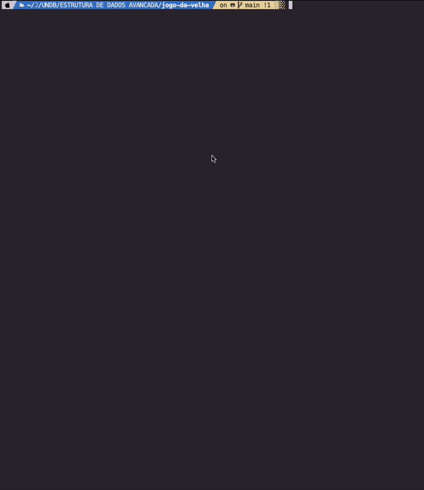

jogo-da-velha
=============
## Instalação
### Requisitos
* Git
* Node 14 +
* NPM
* Yarn

### Instalando
1. clone o repositório na sua máquina 
```shell
git clone git@github.com:alissonphp/jogo-da-velha-minimax.git
```
2. instalação das dependências
```shell
yarn
```
ou
```shell
npm install
```

## Executando
1. bastar chamar o executável da pasta bin passando os parâmetros desejados
```shell
./bin/run jogar
```
2. caso esteja no Windows:
```shell
./bin/run.cmd jogar
```

## Demonstração

